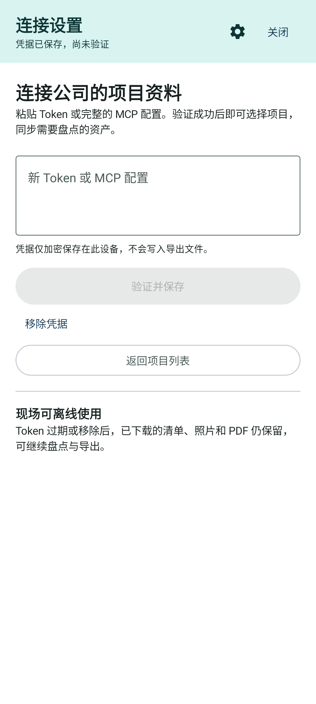
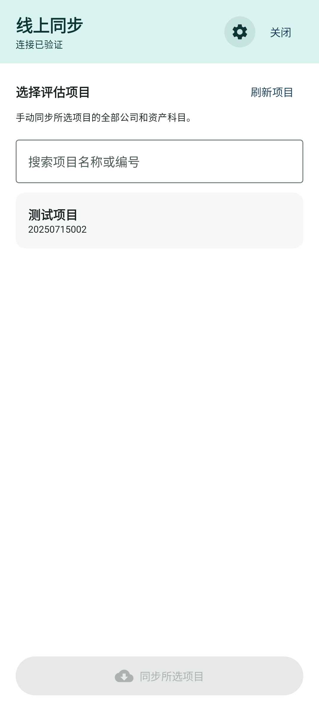
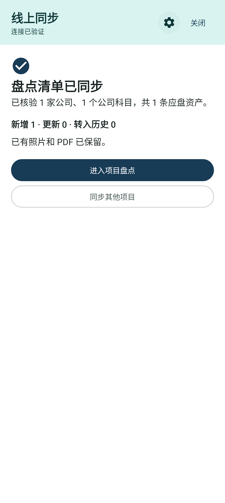
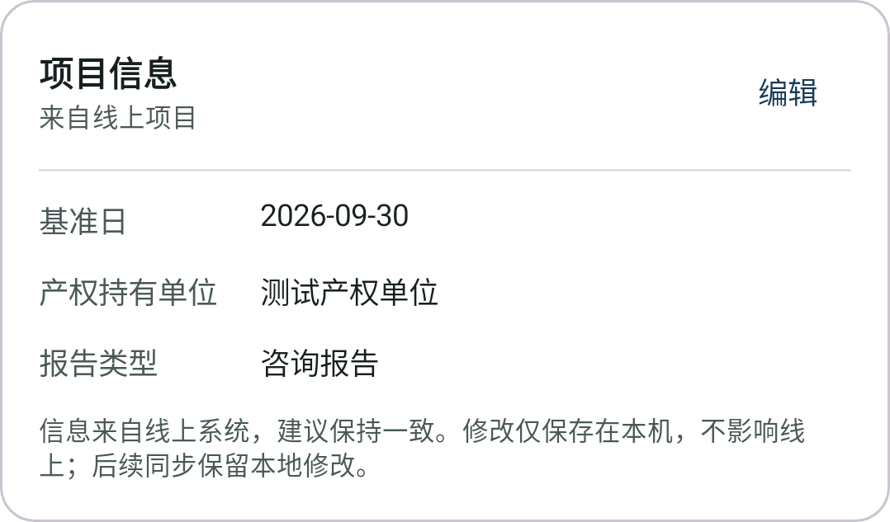

# 点检 · Tenken

Android 资产盘点工具。通过公司 MCP 获取项目和应盘资产，在现场离线拍照、添加水印、生成 PDF，并导出 ZIP 资料。

## 开始使用

1. 打开 **线上同步 → 连接设置**，粘贴客户 Token，或包含 `valuation-mcp` 的完整 MCP 配置。
2. 点击 **验证并保存**。App 通过项目查询验证新凭据，成功后才替换旧 Token。
3. 按名称或项目编号搜索，选择项目后点击 **同步所选项目**。
4. 同步完成后进入项目盘点，拍照、查看照片、生成 PDF 或导出 ZIP。

也支持本地台账导入、按分类抽样和本地项目。手机与电脑在同一局域网时可使用 Wi-Fi 传输：主界面或侧边栏开启后自动复制完整配对地址，顶部提供“复制传输地址”按钮，侧边栏完整地址也可点击复制。地址包含临时配对 Token，重新开启服务后应重新复制。首次使用 MCP 联网功能需要有效 Token；已有盘点资料可以离线使用。

<p>
  
  
  
</p>

截图来自界面测试，使用虚构凭据和测试数据。

## 同步与数据保留

App 直接连接 `https://mcp.zhrdc.net/valuation-mcp`，不依赖 WebView、网页登录、SpreadJS 列提取、模型调用或中转服务器。

- 手动加载项目、手动同步。按项目遍历全部公司及其实际 C3/C4 资产科目，完整翻页读取普通底稿 JSON，筛选 `SFPD`（是否盘点）为“是”的资产。
- 整个项目读取成功后才在一个 Room 事务中更新本地清单。网络中断、权限错误或分页不完整时保留上次完整清单。
- 重复同步复用稳定远端行 ID 对应的本地 UID，保留照片、PDF、水印与项目设置。
- 取消盘点或从完整快照中消失的资产转入历史，默认排除在当前盘点和项目 ZIP 之外。**历史与核对**可查看照片/PDF，单独导出资料。
- 身份缺失、旧记录无法可靠关联或远端 ID 重复时保留旧资料，提示人工核对，不按名称自动合并。纠正源数据后可重新同步。
- 当前凭据无法访问旧项目时，标明无法核验并保留本地资料。

### 线上项目信息与本地修改

同步通过 `get_project_context` 读取 `evaluationBaseDate` 和 `businessType`，基准日按 UTC+08:00 转为日期；公司名称来自 `get_project_companies` 返回的全部单位。评估/咨询业务分别显示为评估报告/咨询报告；业务类型缺失时显示“待确认”，其他业务类型保留原文，不用报告模板类型推断业务类型。

评估报告显示“评估基准日、被评估单位”；其他类型显示“基准日、产权持有单位”。线上项目提示建议保持一致。编辑只在本机保存，后续同步保留本地修改，不调用任何远端写入接口。数据库升级也保留已有手工填写的设置。



### Token 更新

连接设置可随时验证、更换或移除 Token。新 Token 未通过验证不会覆盖原凭据。凭据用 Android Keystore 密钥和 AES-GCM 加密，保存在不参与系统备份的设备目录，不写入日志或导出文件。

Token 失效只暂停联网读取，已下载的资产、照片和 PDF 仍可离线盘点与导出。服务未提供可靠到期时间，因此界面显示验证状态，不推算到期倒计时。

### 系统回传的边界

本版本已关闭系统回传，PDF 生成不再产生上传任务。升级时取消旧 WorkManager 上传重试；保留旧 Worker 类名作为不联网的兼容入口，保留旧数据库表和本地文件。

现有 PDF/ZIP 导出继续可用。**供客户自行上传的标准结构化压缩包尚未实现**，需待上传格式确定后单独开发。

## 开发与构建

- JDK 21；Android SDK 36.1；最低运行版本 Android 8.0（API 26）。
- Gradle Wrapper 和依赖版本由仓库管理。通过 Android Studio 配置 SDK，或在本机 `local.properties` 中设置 `sdk.dir`。
- Windows 使用 `gradlew.bat`；macOS/Linux 使用 `bash ./gradlew`。

```powershell
# 编译可安装的调试包
.\gradlew.bat :app:assembleDebug

# 单元、协议、数据库同步、Token 与 Compose 界面回归
.\gradlew.bat :app:testDebugUnitTest

# Android 静态检查
.\gradlew.bat :app:lintDebug

# 生成 MCP 界面测试截图（PowerShell 需保留参数引号）
.\gradlew.bat :app:testDebugUnitTest --tests '*McpConnectionUiTest' '-Proborazzi.test.record=true'
```

APK 输出：`app/build/outputs/apk/debug/app-debug.apk`。测试报告和截图位于 `app/build/reports/`。

调试构建优先使用本机已有 `debug.keystore`，缺少时使用 Android 默认调试签名。正式构建需要通过 `KEYSTORE_PATH`、`STORE_PASSWORD`、`KEY_PASSWORD` 提供签名配置，别名为 `upload`。不同签名不能直接覆盖安装。

GitHub Actions 执行测试并构建调试 APK，产物保存在 Actions Artifacts；普通推送不会自动发布 Release。

### 可选真实 MCP 联调

向测试进程提供 `VALUATION_MCP_TEST_TOKEN` 环境变量，再运行：

```powershell
.\gradlew.bat :app:testDebugUnitTest --tests '*McpLiveReadTest'
```

该测试只读取编号 `20250715002` 的测试项目，不写远端、不输出 Token。未配置环境变量时跳过。默认 CI 不依赖客户凭据。

数据库迁移的设备测试位于 `app/src/androidTest/`，连接设备或模拟器后运行 `:app:connectedDebugAndroidTest`。

## 代码结构

| 位置 | 职责 |
| --- | --- |
| `onlinepull/McpClient.kt` | MCP 初始化、会话、JSON/SSE 响应及只读工具白名单 |
| `onlinepull/AssessmentSystemClient.kt` | 项目/公司/科目查询、分页校验与资产字段解析 |
| `onlinepull/RemoteSyncRepository.kt` | 完整快照、稳定身份匹配、事务更新、历史和冲突 |
| `onlinepull/McpTokenStore.kt` | 凭据输入解析和加密存储 |
| `ui/RemoteSyncViewModel.kt` | 连接、Token 更新与手动同步状态 |
| `onlinepull/AutoOnlinePullScreen.kt` | 连接设置、项目选择和同步结果 |
| `onlinepull/RemoteHistoryDialog.kt` | 历史资料查看与单条导出 |
| `data/`、`ui/StockViewModel.kt` | 本地台账、照片、PDF 和 ZIP |

这些路径均相对于 `app/src/main/java/com/example/`。

`.env`、Token、签名文件、本地数据库、照片/PDF、联调原始响应与构建缓存不纳入版本管理。`.tmp_debug/` 仅保留本机诊断资料。
